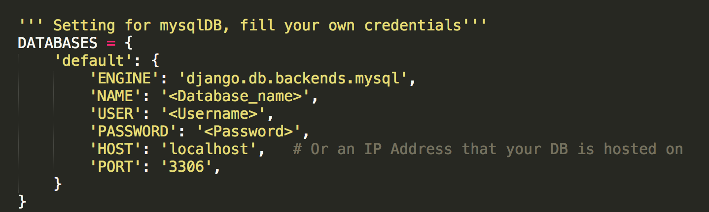

# django-mycar
Mycar is an online marketplace for car shoppers and sellers. For the sake of simplicity, there is no user profile and authentication implemented.

# Objective & features:
* Mycar (http://127.0.0.1:8000/mycar/) home page where users can see all the listing, cars for sale page and sale your car     option to create new list. 
* A dynamic search engine which used optimized querysets “Q() object” to search car by make, model or keyword. If no match found, it will display a message "Sorry, you have entered an invalid search, please try again."
* Django messaging framework to display custom messages.
* Custom navbar to stay visible on scrolldown.
* Bootstarp carousel is being used to animate the welcome images.
* Scalable pagination which only display three or six post at a homepage. If number of post exceeds six, than it will show a navigation bar to go to next page.
* Custom "make/model" and "Type" dropdown option which display the number of make/model and type of vehicle available at real-time database synchronization.
* Search price range modal which is a dialog popup window that displayed on top of the current page with max and min price choices. Javascript is being used to disable the search button until both options are filled.
* Zoom out list images on hover with CSS.
* Key features modal dialog popup window displays key information for that particular post.
* Full detail page option for individual post.
* Jquery is being used to display related content when click on "Buying" or "Selling" buttons without refreshing the page.
* Select_related & Prefetch_related is being used to improve our queries performance.
* Populate options in create post form.
* Dynamic urls.
* Responsive design for any screen size.

# Javascript & JQuery animations.
* Ajax calls to populate results real-time without refreshing the page.
* Navbar stays at the top as we scroll down.
* Flashing effects for success & error messages.
* Disable submit buttons for blank submission.

# Steps to run:

### Step 1:
Create a folder.

$ mkdir django_mycar

Create a virtual enviroment.

$pip install virtualenv

$ cd django_mycar

$ virtualenv env

$ source env/bin/activate

### Step 2:
Install requirements.txt

$pip install -r requirements.txt

### Step 3:
Edit settings.py with database credentials.

  

### Step 4:
Database migrations.

$ python manage.py makemigrations

$ python manage.py migrate

### Step 5:
Run project.

$ python manage.py runserver

